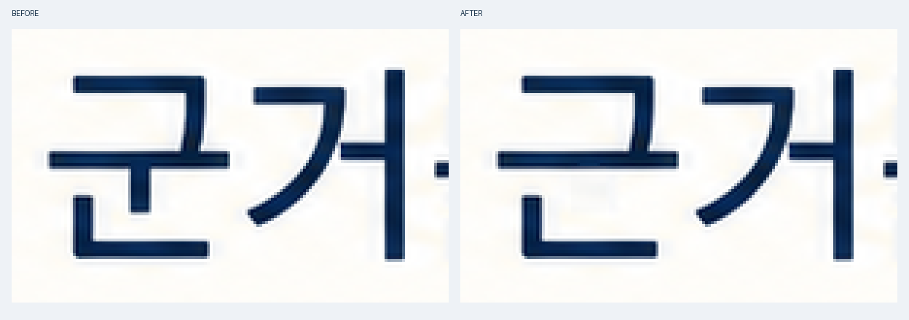

# Korean Slide Image

한글 슬라이드·인포그래픽을 만들고 이미지 속 오타를 검수·교정하는 Codex 스킬입니다. **일부 한글 오자는 이미지를 다시 생성하지 않고, 잘못된 획만 코드로 제거해 복구합니다.**



위 예시는 `군거→근거`를 199픽셀만 수정했습니다. 실제 획 마스크 밖 변경은 0픽셀이며, 수정 과정의 이미지 생성 호출은 없었습니다. 오타를 의도적으로 넣어 만든 시험 이미지입니다. [대표 전후 비교와 놓침·보류 예시](docs/evidence/README.md)

생성 프롬프트만으로 한글 무오류를 보장하지 않습니다. 이 스킬의 역할은 원문을 기준으로 오류를 찾고, 디자인을 보존할 수 있는 수정을 검수하며, 미해결·불확실한 항목을 기록하는 것입니다. 파일 연결과 픽셀 보존 검사는 코드가 수행하고, 글자 모양과 디자인은 실행자가 직접 검수합니다. 시각 검수자가 오류를 놓칠 가능성도 남아 있습니다.

## 설치

Codex에서 다음과 같이 요청합니다.

```text
$skill-installer로 아래 GitHub 스킬을 설치해줘.
https://github.com/epoko77-ai/korean-slide-image/tree/main/skills/korean-slide-image
```

스킬 설치 후 다음 대화 턴부터 사용할 수 있습니다. 이미 같은 이름의 스킬이 설치돼 있으면 기존 작업을 보관한 뒤 업데이트 경로를 선택합니다.

실제 이미지 생성에는 Codex에 제공되는 내장 이미지 생성 도구가 필요합니다. 이 저장소의 Python 스크립트가 이미지 생성 API를 직접 호출하지는 않습니다. 로컬 검사·합성에는 Python 3.10 이상과 [Pillow](requirements.txt)가 필요합니다. 선택적 OCR 도구는 macOS의 Swift와 Apple Vision을 사용합니다. OCR을 사용할 수 없는 환경의 시각 검수 경로는 [실행 절차](skills/korean-slide-image/references/workflow.md)에 설명돼 있습니다.

## 사용

새 이미지를 만들 때:

```text
$korean-slide-image로 첨부한 슬라이드를 이미지로 만들어줘.
```

기존 이미지의 오타를 고칠 때:

```text
$korean-slide-image로 이 이미지의 오타를 고쳐줘.
```

원문·숫자 보존, 디자인 유지, 한글 검수와 확인된 오타의 국소 수정은 스킬이 기본으로 수행합니다. 특정 단어만 고치고 싶다면 ‘중가를 증가로 고쳐줘’처럼 대상만 덧붙이면 됩니다. 정답을 확인할 자료가 없거나 판독이 모호할 때는 필요한 문구를 확인합니다.

## 디자인을 지키는 원칙

- **만들기 전:** 제목·본문·숫자의 크기와 배치, 글자 효과와 배경 대비를 함께 설계합니다.
- **고칠 때:** 기준 이미지의 서체 느낌·자폭·굵기·자간·그림자와 배경을 유지하는 후보를 만듭니다.
- **채택할 때:** 원본과 나란히 비교해 문구와 디자인을 모두 확인합니다. 수정 영역 밖 픽셀이 같다는 것만으로 합격시키지 않습니다.
- **복구가 어려울 때:** 일반 폰트로 자동 대체하거나 디자인을 단순화하지 않습니다. 기준본을 보관하고 해결되지 않은 부분을 명시합니다.

폰트 재렌더링은 같은 폰트·조판·효과와 배경을 재현할 수 있을 때 검토하는 방법입니다. 다른 폰트로의 대체는 별도의 디자인 변경입니다. 코드 합성이 가능한 경우에도 채택한 영역을 제한해서 붙이는 용도로 사용합니다. 사용자에게 긴 방법 지시를 요구하지 않으며, 실제 실행은 도구 규칙과 사용자 선택을 따릅니다.

코드 편집이 허용된 경우에는 **불필요한 획만 지우는 복구 경로**도 사용합니다. 초성·종성은 같고 중성이 `ㅗ/ㅜ→ㅡ` 또는 `ㅕ→ㅓ`로 달라진 오자를 실제로 확인한 뒤, 실행자가 선택한 작은 획만 주변 픽셀로 복구합니다. 글꼴을 새로 덮지 않고, 고정한 획 마스크 밖의 픽셀은 그대로 유지합니다. 복잡한 배경이나 남겨야 할 획을 구분하기 어려운 경우에는 보류합니다. OCR의 글자 좌표는 힌트이며, 자동 오류 판정이나 자동 마스크 생성 기능은 아닙니다.

글자를 문맥으로 추측해 읽는 문제를 줄이기 위해 **글자 분리 점검 도구**도 제공합니다. OCR이 일치한 `ㅡ`·`ㅓ` 음절까지 여백과 함께 확대하고, 정답을 별도 파일로 분리해 먼저 모양을 읽게 합니다. 대조 결과는 원본에서 다시 확인하며 자동 삭제로 이어지지 않습니다.

## 처리 과정

| 단계 | 역할 |
|---|---|
| `freeze` | 원문·실제 프롬프트·참조 이미지와 수정 영역을 고정하고 문구 포함 여부 검사 |
| `register` | 실제 PNG를 디코딩하고 파일들을 해시로 연결 |
| `gate` | 문구별 시각 판정, 원시 OCR, 추가·누락 문구, 디자인 및 요청한 보존 검사 확인 |
| `release` | 검수 증거를 다시 확인하고 통과한 PNG 바이트를 그대로 출고 |

문구와 디자인 검수가 끝나지 않으면 `needs_review`, 확인된 오류가 남으면 `unresolved`, 필요한 검사를 통과하면 `verified`로 기록합니다. OCR 일치만으로 합격시키지 않습니다.

- [스킬 지침](skills/korean-slide-image/SKILL.md)
- [실행 명령과 검수 기록 형식](skills/korean-slide-image/references/workflow.md)
- [부분 편집·폰트 복구·픽셀 보존](skills/korean-slide-image/references/repair.md)
- [시각 확인한 획의 국소 복구](skills/korean-slide-image/references/stroke-repair.md)
- [원문 추출과 OCR](skills/korean-slide-image/references/text-and-evidence.md)

## 검증과 현재 한계

기계 테스트 **52개**는 문자열 비교, 오래된 검수 기록 거절, 파일 연결, 실제 획 마스크 밖의 변경, 글자 점검 카드와 판독 기록의 연결을 확인합니다. 실제 한글을 읽는 정확도를 측정하는 테스트는 아닙니다.

48장 생성 비교에서는 한글 문구가 통과한 이미지가 스킬 없이 **14/24장**, 사전 지침을 적용했을 때 **18/24장**이었습니다. 작은 본문 조건은 양쪽 모두 **0/3장**이었습니다. 이후 7개 오류 위치의 복구 파일럿에서는 문구·디자인 동시 통과가 단어 생성형 수정 **3/7**, 글자 참조를 넣은 생성형 수정 **2/7**, 수동 획 복구 **5/7**이었습니다. 편의 표본에 대한 AI 시각 검수이며 일반적인 성공률이나 무오류 보장으로 해석하면 안 됩니다. 생성 비교와 사후 복구는 서로 다른 실험입니다.

새 복구 도구는 정답 위치를 숨긴 **별도 카드 18장**으로 시험했습니다. 오류 10개 중 **9개를 발견해 7개 복구, 2개 보류**, 1개는 놓쳤습니다. 정상 8장은 오수정 없이 보존했습니다. 수정한 7장은 합계 167픽셀만 바뀌었고 실제 획 마스크 밖 변경은 0이었습니다. 이 18장은 폰트로 만든 통제 자료입니다. 별도의 AI 생성 슬라이드 2장에서는 1장 복구·1장 보류였습니다. OCR과 AI 시각 검수가 같은 오자를 함께 놓친 사례까지 [검증 범위](docs/validation.md)에 공개합니다.

이후 글자 분리 점검을 **통제 이미지 48장**으로 비교했습니다. 실제 오류 24개 중 기존 검수는 **22개**, 글자 분리 점검 후 문맥 재확인은 **24개**를 찾았습니다. 정상 24장은 양쪽 모두 오판이 없었습니다. 서로 다른 검수자의 작은 통제 시험이며, 일반적인 정확도나 획 삭제 성공률을 입증한 결과는 아닙니다.

현재 보완할 항목:

1. `release`의 보존 검사는 마지막 수정 단계에 한정됩니다. 여러 번 수정한 결과는 최초 원본부터 `patch_image.py verify`를 별도로 실행해야 합니다.
2. `freeze`는 부분 문자열 포함 검사입니다. 문구별 위치나 반복 횟수까지 자동으로 확인하지 않습니다.
3. 획 복구는 실행자의 위치·마스크 선택을 돕는 제한된 도구입니다. 겹받침 변경, 획 추가, 일반적인 폰트·배경 복원은 자동 처리하지 않습니다.
4. 최종 글자 판정은 실행자의 관측입니다. 작은 글씨·복잡한 배경·여러 장의 자동 생산에 대한 폭넓은 검증은 남아 있습니다.

자세한 근거와 보완 순서는 [검증 범위](docs/validation.md)를 참고하세요.

## 결과와 예시

- [대표 전후 비교 · 놓친 오류 · 보류 예시](docs/evidence/README.md)
- [생성 비교·복구 시험·48장 검수 비교의 방법과 수치](docs/validation.md)
- [집계 결과 JSON](docs/validation-results.json) · [48장 검수 결과 CSV](docs/inspection-results.csv)
- [예시의 수정 픽셀을 직접 검산하는 코드](tools/verify_examples.py)

약 2MB의 대표 이미지와 결과표를 저장소에서 바로 볼 수 있습니다. 전체 원본·OCR·세부 로그는 로컬 검증용으로 보관하며 대용량 자료를 내려받을 필요가 없습니다.

## 개발 및 테스트

저장소를 받은 뒤 가상 환경에서 실행합니다.

```bash
python3 -m venv .venv
source .venv/bin/activate
python -m pip install -r requirements.txt
python -B -m unittest discover -s skills/korean-slide-image/scripts -p 'test_*.py' -v
```

GitHub Actions에서도 같은 테스트를 실행합니다. 이미지 생성과 OCR은 CI에서 실행하지 않습니다. 공개 예시의 파일·픽셀 검산은 `python tools/verify_examples.py`로 실행합니다. 폰트 파일과 실행 캐시는 배포하지 않습니다.
