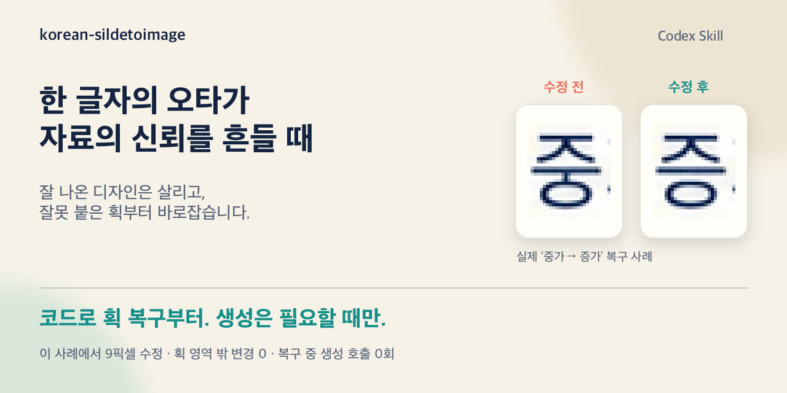
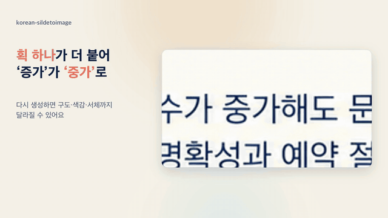
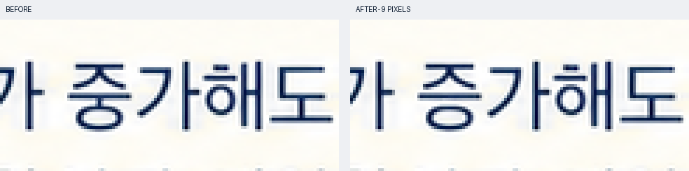

# korean-sildetoimage

**한글 오타는 코드로 먼저 고치고, 이미지 생성은 꼭 필요할 때만.**

한 글자의 오타만으로도 보는 사람은 자료 전체가 제대로 검토됐는지 의심할 수 있습니다. 잘 나온 디자인을 살리면서 한글을 바로잡아, 내용에 대한 신뢰까지 지키고 싶었습니다.

`korean-sildetoimage`는 **이미 나온 이미지를 최대한 살리면서 한글을 교정하는 Codex 스킬**입니다. 원문과 글자 모양을 검수하고, 잘못 붙은 작은 획은 이미지 생성 모델을 다시 호출하지 않고 코드로 복구합니다. **코드로 해결하기 어려운 경우에만 필요한 부분을 생성형으로 편집합니다.**

```text
원문·글자 검수 → 가능한 획은 코드로 복구 → 필요할 때만 국소 생성형 편집 → 재검수
```

잘 나온 디자인을 유지하면서 불필요한 생성 호출을 줄이는 것이 이 스킬의 원칙입니다. 전체 이미지를 다시 만드는 것은 기본 교정 방법이 아닙니다.

## 왜 이런 순서로 고치나요?

AI로 만든 슬라이드가 마음에 듭니다. 구도도, 색감도, 글자 분위기도 좋습니다. 그런데 ‘증가’가 ‘중가’로 그려져 있습니다. 한 글자만 고치고 싶은데, 다시 생성하면 잘 나온 디자인까지 달라질 수 있습니다.

확대해 보니, 어떤 오류는 **작은 획 하나가 더 붙은 것**이었습니다. 그 부분의 픽셀만 고칠 수 있다면, 이미지를 다시 생성할 이유가 없습니다. 이 스킬은 그 착안에서 출발했습니다. 먼저 기존 글자를 복구할 방법을 찾고, 생성형 편집은 복구에 필요한 경우에 사용합니다.

새 슬라이드를 만드는 요청도 지원합니다. 첫 이미지를 생성한 뒤에는 같은 원칙으로 검수하고, 코드로 고칠 수 있는 오류부터 복구합니다.



[30초 소개 영상](https://github.com/epoko77-ai/korean-sildetoimage/releases/download/intro-20261007/intro-landscape.mp4) · [실제 전후 비교](docs/evidence/README.md) · [검증 결과](docs/validation.md)

<a href="https://github.com/epoko77-ai/korean-sildetoimage/releases/download/intro-20261007/intro-landscape.mp4"></a>

## 실제로, 9픽셀만 바꿨습니다

아래는 AI가 생성한 슬라이드의 긴 문단에서 **‘중가’를 ‘증가’로 복구한 실제 사례**입니다. `ㅜ`에 붙은 짧은 세로획을 지워 `ㅡ`로 되돌렸습니다.



| 이 사례에서 확인한 것 | 결과 |
|---|---:|
| 바뀐 픽셀 | **9개** |
| 지정한 획 영역 밖의 변경 | **0개** |
| 획 복구 중 이미지 생성 호출 | **0회** |

글꼴을 새로 입히지 않고, 확인한 작은 획을 주변 픽셀로 복구했습니다. 완성된 글자와 슬라이드를 다시 검수했습니다. 이 수치는 **이미 발견해 둔 오류 한 건의 개발 사례**이며, 모든 한글 오류를 9픽셀로 고친다는 뜻은 아닙니다. 위 비교 이미지와 공유용 썸네일의 글자 확대에는 같은 실제 복구 자료를 사용했습니다.

## 요청은 짧게 하세요

새 슬라이드를 만들 때:

```text
$korean-sildetoimage로 첨부한 슬라이드를 이미지로 만들어줘.
```

이미지의 오타를 고칠 때:

```text
$korean-sildetoimage로 이 이미지의 오타를 고쳐줘.
```

**원문·숫자 보존, 한글 검수, 디자인을 유지하는 국소 수정은 스킬에 들어 있습니다.** 사용자가 긴 지침을 붙이거나 글자 좌표를 찾을 필요는 없습니다. 특정 단어만 고치려면 ‘중가를 증가로’처럼 대상만 덧붙이면 됩니다. 정답을 확인할 수 없을 때는 문구를 먼저 확인합니다.

## 어떻게 고치나요?

1. **원문과 실제 글자를 대조합니다.** 생성 전에 문구와 배치를 점검하고, 생성 후에는 원문·OCR·확대 이미지를 함께 봅니다. OCR이 정답처럼 읽어도 획이 틀릴 수 있어 글자 모양을 확인합니다.
2. **코드로 복구할 수 있는지 먼저 봅니다.** 불필요한 획이 명확하면 에이전트가 수정 위치를 정하고, 코드가 그 범위의 픽셀을 복구합니다. 코드 복구로 해결하기 어려울 때만 작은 영역의 생성형 편집을 검토합니다. 원래 서체·굵기·자간·배경을 보존하는 것이 기준입니다.
3. **수정본을 다시 검수합니다.** 완성된 글자가 맞는지, 디자인이 자연스러운지, 허용 범위 밖의 픽셀이 그대로인지 확인합니다. 여러 번 고쳤다면 최초 원본부터의 수정 이력도 검사합니다.

생성 전 지침은 오류를 줄이기 위한 준비이고, 생성 후 검수와 복구는 이미 나온 결과를 확인하고 고치는 단계입니다. **이미지 생성 모델의 내부 과정을 직접 제어하는 스킬은 아닙니다.**

현재 코드 획 복구는 `ㅗ/ㅜ → ㅡ`, `ㅕ → ㅓ`처럼 **불필요한 획을 제거해 바로잡을 수 있는 일부 오류**를 다룹니다. 같은 타이포를 유지하는 국소 복구 가능성을 먼저 살피고, 그것으로 해결하기 어려울 때만 생성형 부분 편집을 검토합니다. 남겨야 할 획이 엉켜 있거나 배경을 자연스럽게 복원하기 어려우면 원본을 보관하고 수정을 보류합니다.

## 어디까지 검증했나요?

잘된 예시와 함께 놓친 오류·보류한 사례도 공개했습니다.

| 시험 | 관측 결과 |
|---|---|
| 48장 생성 비교 | 문구 통과: 스킬 없이 **14/24장**, 생성 전 지침 적용 **18/24장**. 작은 본문 조건은 양쪽 모두 **0/3장** |
| 정답 위치를 숨긴 통제 카드 18장 | 오류 10개 중 **9개 발견 → 7개 복구·2개 보류**, 1개 놓침. 정상 8개는 오수정 없음 |
| 글자 분리 점검 비교, 통제 이미지 48장 | 오류 24개 중 기존 검수 **22개**, 글자 분리 후 문맥 재확인 **24개** 발견. 정상 24개는 양쪽 모두 오판 없음 |
| 코드 테스트 | **73개**. 검수 기록, 파일 연결, 수정 범위 밖 픽셀, 수정 이력 등 검사 |

각 행은 **서로 다른 시험**입니다. 작은 표본과 AI 시각 검수에 기반하며 일반 성공률을 뜻하지 않습니다. 통제 카드는 폰트로 만든 자료이고, 실제 생성 이미지 검증과 구분했습니다. 코드 테스트 73개도 한글을 읽는 정확도를 측정한 수치가 아닙니다.

글자 위치와 수정 마스크는 여전히 실행 에이전트의 판단이 필요합니다. 작은 글씨, 복잡한 배경, 여러 줄 문단과 반복 문구에는 한계가 있습니다. [시험 방법·전체 집계·현재 한계](docs/validation.md)에서 자세히 볼 수 있습니다.

## 설치

Codex에서 다음과 같이 요청하세요.

```text
$skill-installer로 아래 GitHub 스킬을 설치해줘.
https://github.com/epoko77-ai/korean-sildetoimage/tree/main/skills/korean-sildetoimage
```

설치 후 다음 대화 턴부터 사용할 수 있습니다. 기존 버전을 쓰고 있다면 이 주소로 업데이트하고 새 호출명 `$korean-sildetoimage`를 사용하세요.

이미지 제작에는 Codex의 내장 이미지 생성 도구가 필요합니다. 로컬 검사·복구에는 Python 3.10 이상과 [Pillow](requirements.txt)를 사용하며, 선택적 OCR은 macOS의 Swift·Apple Vision을 사용합니다. OCR이 없는 환경의 시각 검수 경로는 [실행 절차](skills/korean-sildetoimage/references/workflow.md)에 있습니다. 이 저장소의 스크립트는 이미지 생성 API를 직접 호출하지 않습니다.

## 더 살펴보기

- [대표 전후 비교·놓친 오류·보류 예시](docs/evidence/README.md)
- [검증 방법과 결과](docs/validation.md) · [집계 JSON](docs/validation-results.json) · [48장 점검 CSV](docs/inspection-results.csv)
- [스킬 지침](skills/korean-sildetoimage/SKILL.md) · [실행·검수 기록](skills/korean-sildetoimage/references/workflow.md)
- [획 복구 방법](skills/korean-sildetoimage/references/stroke-repair.md) · [부분 편집과 디자인 보존](skills/korean-sildetoimage/references/repair.md)
- [소개 영상·썸네일·SNS 글](docs/social/README.md)

저장소에는 대표 이미지와 집계 결과를 담았습니다. 대용량 실험 원본이나 전체 OCR 로그를 내려받을 필요는 없습니다.

## 개발 및 테스트

```bash
python3 -m venv .venv
source .venv/bin/activate
python -m pip install -r requirements.txt
python -B -m unittest discover -s skills/korean-sildetoimage/scripts -p 'test_*.py' -v
python tools/verify_examples.py
```

GitHub Actions에서도 같은 검사를 실행합니다. 이미지 생성과 OCR은 CI에서 실행하지 않습니다. 폰트 파일과 실행 캐시는 배포하지 않습니다.
