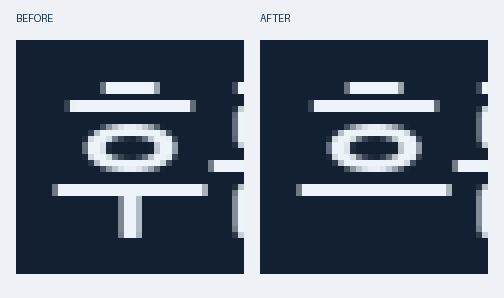
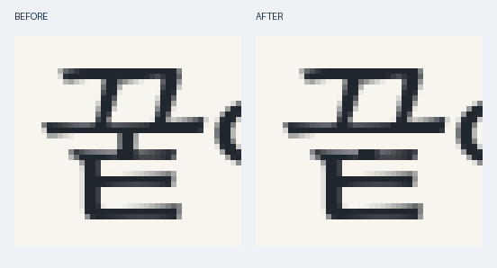
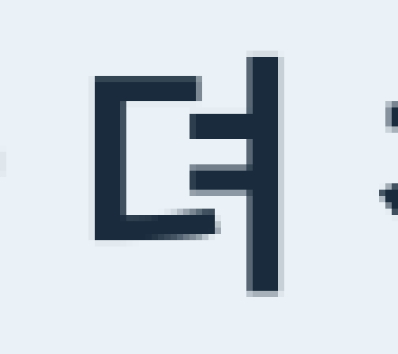
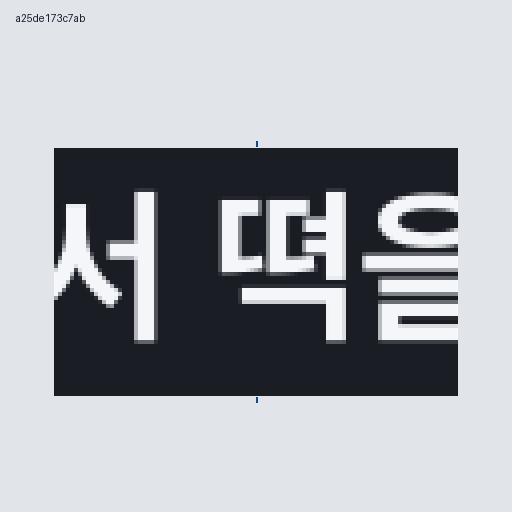
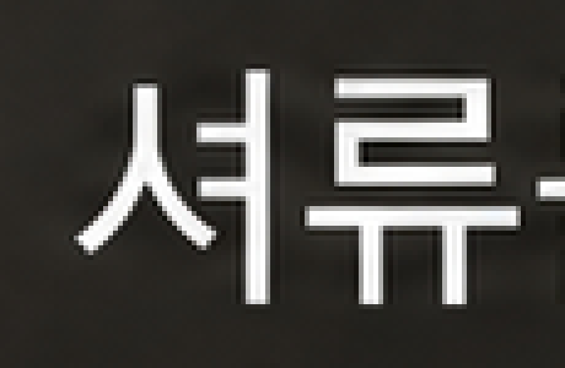
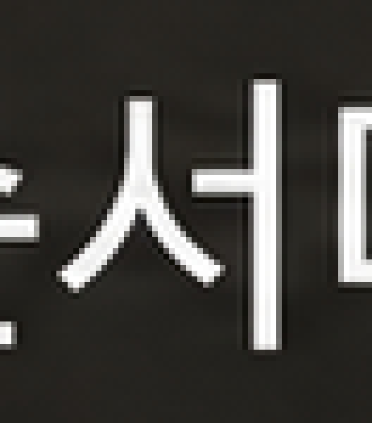

# 한글 획 복구: 결과와 대표 예시

정답 문구와 실제 글자를 대조한 뒤, 실행자가 고른 불필요 획만 코드로 제거합니다. 글꼴을 새로 덮거나 이미지를 다시 생성하지 않습니다. 아래는 선택한 예시이며, 성공률 계산에는 전체 시험의 실패·보류·놓침도 포함합니다.

## 시험 결과

| 시험 | 결과 |
|---|---|
| 생성 전 지침 비교 48장 | 한글 문구 통과: 스킬 없이 14/24, 사전 지침 적용 18/24 |
| 알려진 오류 7곳, 세 복구 방식 | 문구·디자인 통과: 단어 생성형 3/7, 글자 참조 생성형 2/7, 수동 획 복구 5/7 |
| 위치를 숨긴 획 복구 카드 18장 | 오류 10개 중 9개 발견, 7개 복구, 2개 보류, 1개 놓침. 정상 8장 오수정 0 |
| 별도 AI 생성 이미지 2장 | 1장 복구, 1장 보류. 오타를 의도적으로 넣은 자료 |
| 글자 분리 검수 비교 48장 | 오류 24개 중 기존 검수 22개, 분리 점검 후 문맥 확인 24개 발견. 정상 24장 오판은 양쪽 0 |

서로 다른 시험을 합쳐 하나의 성공률로 제시하지 않습니다. AI 시각 검수와 폰트 통제 자료가 포함된 작은 시험입니다. [방법과 한계](../validation.md) · [집계 JSON](../validation-results.json) · [48장 검수 결과 CSV](../inspection-results.csv)

## 1. 생성 이미지: 군거 → 근거


**199픽셀 수정 · 실제 획 마스크 밖 변경 0 · 수정 중 이미지 생성 호출 0회.** 오타를 의도적으로 넣어 생성한 이미지의 예시입니다. 전체 문구와 주변 디자인을 함께 검수했습니다.

[수정 전 전체 PNG](generated-gungeo/before.png) · [수정 후 전체 PNG](generated-gungeo/after.png)

## 2. 통제 카드: 후름 → 흐름



**28픽셀 수정 · 마스크 밖 변경 0.** 모음 아래 돌출만 제거했습니다. 정답 위치를 숨긴 18장 시험의 성공 사례입니다. 정답 폰트를 다시 렌더링한 것과 픽셀까지 완전히 같다는 뜻은 아닙니다.

## 3. 새로 찾은 오류: 꿑 → 끝



기존 검수가 놓친 글자를 새 점검에서 불확실로 남기고 문맥 재확인으로 발견했습니다. **12픽셀 수정 · 마스크 밖 변경 0.** 수정은 채점과 정답 공개가 끝난 뒤 별도로 수행한 개발 예시이며, 위 탐지 성적이나 별도 복구 성공률에 합산하지 않습니다.

## 4. 문맥으로 읽으면 놓칠 수 있는 획

| 이전 시험에서 놓친 `뎌` | 추가 시험에서 새 방식이 찾은 `뗙` |
|---|---|
|  |  |

왼쪽은 원시 OCR과 두 AI 검수자가 `더`로 읽었던 실패입니다. 오른쪽은 “시장 골목에서 떡을 샀다.”의 실제 `뗙`을 기존 검수가 `떡`으로 읽은 사례입니다. 큰 글씨도 문맥에 맞게 보완해 읽을 수 있어 음절 모양을 따로 확인합니다. 발견했다고 곧바로 획을 삭제하지는 않습니다.

## 5. 보류: 셔류 → 서류

| 실제 오자 확대 | 같은 이미지의 정상 `서` 참고 |
|---|---|
|  |  |

두 가로팔 중 하나를 지워도 주변 정상 `ㅓ`의 획 높이와 맞지 않아 원본을 유지했습니다. 자모 차이가 지원 목록에 있어도 실제 모양과 배경을 확인해야 합니다.

## 예시 픽셀 직접 확인

대표 수정 3건의 원본·최종 PNG·마스크와 작은 픽셀 계획을 제공합니다. 저장소에서 다음을 실행합니다.

```bash
python -m pip install -r requirements.txt
python tools/verify_examples.py
```

폰트·OCR·이미지 생성·API 키 없이 199·28·12픽셀 변경과 마스크 밖 0픽셀을 재검산합니다. **픽셀 보존 검사이며, 한글을 읽거나 디자인을 판정하는 검사는 아닙니다.** 원본 PNG는 바이트 그대로 복사했고 비교 그림만 관찰용으로 확대했습니다. 전체 실험의 대용량 원본·세부 로그는 로컬에 보관합니다.
